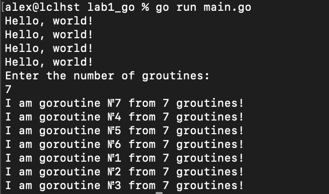
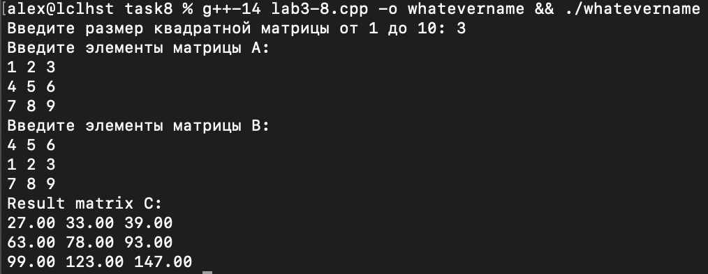
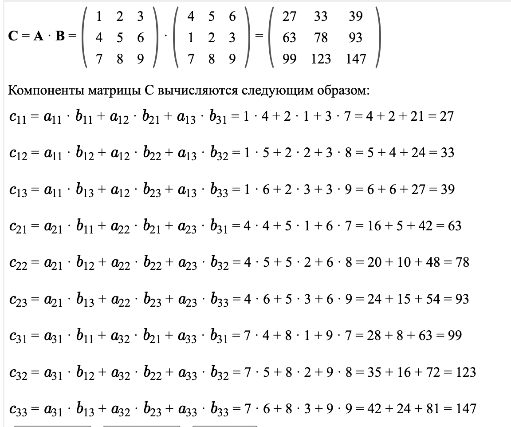
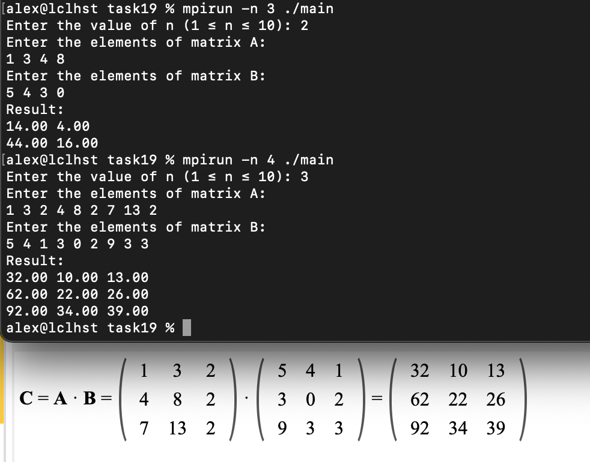
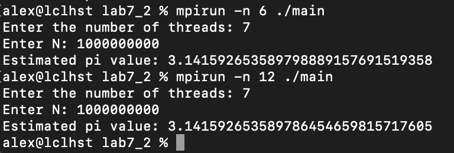

# Demonstration of parallel computing using goroutines in Go, OpenMP, MPI, and their hybrid implementations in both C and C++, as well as GPU computing with CUDA
## Lab 1 - Hello world with multithreading
Implemented in GOlang (with goroutines) and C++ with OpenMP

Usage:
1. `cd lab1/lab1_go && go run main.go`
2. `g++-14 -fopenmp lab1.cpp -o whatevername && mpirun -n 1 ./whatevername` or just `./whatevername`

  
Click to see example

  

## Lab 2 - OpenMP - public and private variables, reduction
#### Distributing the sum function between threads and final summation in a public variable using "reduction"
Usage: `g++-14 -fopenmp lab2-5.cpp -o whatevername && ./whatevername`

## Lab 3 - Parallel matrix multiplication
### Auto-scheduling of computing load dependency on resources availability
#### __Keywords__: "schedule", "section"
Usage `g++-14 lab3-8.cpp -o whatevername && ./whatevername`

  
Click to see example

  
  

## Lab 4 - MPI (Message Passing Interface). Multiprocessing computations
#### __Keywords__: MPI_Init, MPI_Comm_rank, MPI_Comm_size, MPI_Finalize
Usage: `mpicc -g0 -o whatever main.c && mpirun -n 10 ./whatever`
If you wish to run it on cluster of machines, you should use `mpirun -np 10 --host node1,node2,node3,node4 ./whatever` or you can specify a file which contains list of host machines, even with amount of processes for each one

## Lab 5 - MPI Communication Methods
### Exploring MPI_Send, MPI_Recv, and MPI_Sendrecv with Different Communication Schemes
#### __Keywords__: MPI_Send, MPI_Recv, MPI_Sendrecv. Communication schemes: Baton, Master-Worker, Ring, Each-to-Each

## Lab 6 - MPI. Broadcast communications. Distributing blocks of data
#### __Keywords__: MPI_Bcast, MPI_Reduce, MPI_Scatter, MPI_Gather, MPI_Datatype, MPI_Comm, MPI_CHAR, MPI_Op, MPI_MAX, MPI_MIN, MPI_SUM, MPI_PROD
1. Number of occurrences of all characters present in a string
2. Matrix Multiplication using MPI broadcasting

  
Click to see example

  

## Lab 7 - MPI + OpenMP combination.
#### __Keywords__: MPI_Bcast, omp parallel.
Contains examples of combination of the mentioned technologies. Lab7_2 shows how the number PI could be effectively calculated with MPI + OpenMP approaches

  
Click to see example

  

## Lab 8 - CUDA and ACC: Calculating the Value of PI and Performing Matrix Multiplication
#### __Keywords__: CUDA, OpenACC, acc parallel loop reduction
In the given examples, I used CUDA and OpenACC to demonstrate the difference in code complexity for calculating the value of Pi. CUDA is significantly more efficient but requires more extensive coding, while OpenACC is more concise and intuitive.
Additionally, there is an example of matrix multiplication implemented using the CUDA approach.
